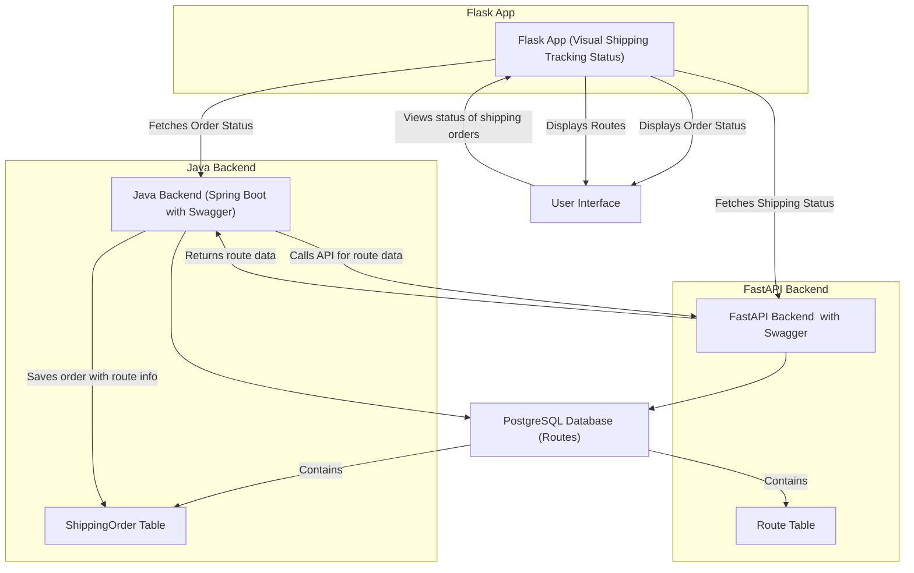

I'll help you set up the project from scratch with all necessary commands. Let's create the project structure and set up each service.

1. First, create the project directory and navigate to it:

```bash
mkdir -p /Users/levi/Workspace/Deployments/tracks/shipping-app
cd /Users/levi/Workspace/Deployments/tracks/shipping-app
```

2. Create directories for each service:

```bash
mkdir shipping-service routes-service tracking-ui
```

3. Set up the Spring Boot project (shipping-service):

```bash
cd shipping-service
curl "https://start.spring.io/starter.tgz" -d "type=maven-project" -d "language=java" -d "bootVersion=3.4.3" -d "baseDir=." -d "groupId=com.shipping" -d "artifactId=shipping-service" -d "name=shipping-service" -d "description=Shipping Management Service" -d "packageName=com.shipping.app" -d "packaging=jar" -d "javaVersion=17" -d "dependencies=web,data-jpa,postgresql,lombok,webflux" -o shipping-service.tgz && tar -xf shipping-service.tgz && rm shipping-service.tgz
```

4. Set up the Python FastAPI project (routes-service):

```bash
cd ../routes-service
python3 -m venv venv
source venv/bin/activate
pip install fastapi uvicorn[standard] sqlalchemy psycopg2-binary python-dotenv pytest httpx
```

5. Set up the Flask UI project (tracking-ui):

```bash
cd ../tracking-ui
python3 -m venv venv
source venv/bin/activate
pip install flask requests python-dotenv pytest
```

6. Create a requirements.txt for both Python projects:

For routes-service:
```bash
cd ../routes-service
pip freeze > requirements.txt
```

For tracking-ui:
```bash
cd ../tracking-ui
pip freeze > requirements.txt
```

7. Create a docker-compose.yml at the root of the project:

```bash
cd ..
touch docker-compose.yml
```

8. Initialize Git repository:

```bash
git init
touch .gitignore
```

9. Create a .gitignore file:

```bash
echo "# Java
target/
*.class
*.jar
*.war
*.ear
.idea/
*.iml

# Python
__pycache__/
*.py[cod]
*$py.class
venv/
.env

# IDE
.vscode/
.idea/

# Logs
*.log

# Environment variables
.env
.env.*" > .gitignore
```

10. Create environment files for each service:

```bash
touch shipping-service/.env routes-service/.env tracking-ui/.env
```

Now that we have the basic structure set up, would you like me to provide:
1. The Docker configuration files
2. Database initialization scripts
3. API endpoint implementations
4. UI templates and static files


Here's how to build and push the images to Docker Hub:

First, let's build all the images with proper tags:

```bash
# Login to Docker Hub (replace 'yourusername' with your Docker Hub username)
docker login

# Build and tag the services
cd /Users/levi/Workspace/Deployments/tracks/shipping-app

# Build shipping service
docker build -t levihernandez/shipping-service:latest ./shipping-service

# Build routes service
docker build -t levihernandez/routes-service:latest ./routes-service

# Build tracking UI
docker build -t levihernandez/tracking-ui:latest ./tracking-ui

# Push images to Docker Hub
docker push levihernandez/shipping-service:latest
docker push levihernandez/routes-service:latest
docker push levihernandez/tracking-ui:latest
```

Then update the deployment files to use the Docker Hub images:

```yaml:/Users/levi/Workspace/Deployments/tracks/shipping-app/k8s/routes-deployment.yaml
      - name: routes-service
        image: levihernandez/routes-service:latest
        imagePullPolicy: Always
```

```yaml:/Users/levi/Workspace/Deployments/tracks/shipping-app/k8s/shipping-deployment.yaml
      - name: shipping-service
        image: levihernandez/shipping-service:latest
        imagePullPolicy: Always
```

```yaml:/Users/levi/Workspace/Deployments/tracks/shipping-app/k8s/tracking-ui-deployment.yaml
      - name: tracking-ui
        image: levihernandez/tracking-ui:latest
        imagePullPolicy: Always
```

